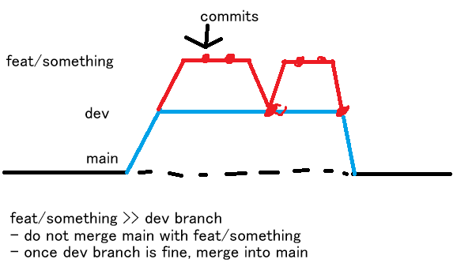

# Chia nhánh làm việc trong GitHub:

## Giải thích:

- Feat là nơi viết code :v vậy thôi.

- Branch dev dùng để chứa code đã merge ở các nhánh feat.

- Main sẽ luôn ở trạng thái ổn định, chỉ chứa code đã được review và test kỹ lưỡng ở dev.

# Đặt tên branch

- Dùng snake-case, ví dụ: feat/login, fix/login, chore/update-dependencies.
- Theo quy ước đặt tên branch sau:
  - **feat/feature-name**: Làm feature mới.
  - **fix/bug-description**: Dùng để sửa lỗi. Ví dụ: fix/login
  - **chore/description**: Dùng để cập nhật cấu hình, dependencies và khác..

# Lấy code về:

- `git pull origin dev` để lấy code mới nhất về máy.
  Lưu ý không lấy từ main mà lấy từ dev!

- Luôn fetch thường xuyên để cập nhật các branch mới được tạo ra. Nên dùng Git Graph extension để dễ quản lý branch.

# Code:

- `git clone <repo-url>` để clone repo về máy. Nhớ cài SSH để push code

- Mỗi người sẽ tạo một branch riêng để làm việc, khi merge phải tạo Pull Request(PR) về **dev**. Nhớ chỉ định reviewer để được review code trước khi merge.

- Tôi có để sẵn template PR và issue để mọi người dễ dàng tạo PR và issue nhanh.

- commit convention: dùng conventional commits, ví dụ: feat: add login feature, fix: correct login bug, chore: update dependencies.

> Nên dùng AI generate commit message để tiết kiệm thời gian và đảm bảo tuân thủ convention. Nhưng phải check kĩ nha!

# Báo bug:

Tạo issue mới với template đã chuẩn bị sẵn.
